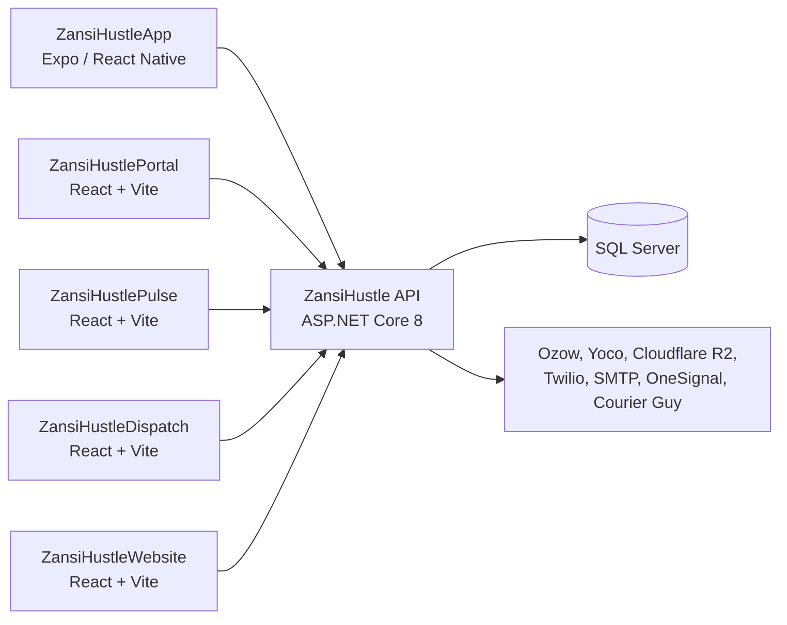

# ZansiHustle API

This is the backend for ZansiHustle, a South African marketplace where people buy products, book local services and run small online shops. It is an ASP.NET Core 8 Web API that serves the mobile app, the admin/seller portal, two internal operations apps and the public website.

It handles accounts, shops, listings, orders, payments, delivery, chat and notifications, plus the admin and moderation work around them.

## What ZansiHustle does

- **Buyers** browse shops, products and services (guests can browse without an account), place orders, pay by instant EFT or card, book services, chat with sellers, leave reviews and get refund credits in a wallet.
- **Sellers** apply to sell, go through approval and KYC, set up a shop, list products (with variants) and services, accept orders and bookings, send parcels with a courier and track their earnings.
- **Casual sellers** can post peer-to-peer marketplace listings. These are kept separate from merchant shop listings.
- **The ZansiHustle team** (admins, support, moderators, accountants, marketing staff and field agents who sign up sellers) run the platform through the portal and the internal apps.

## API responsibilities

- Identity: registration, login, JWT access tokens, refresh tokens, OTP verification, password reset and account deletion.
- Business rules for shops, listings, orders, service bookings, reviews and the wallet.
- Starting payments with external providers and processing their webhooks.
- Delivery quotes at checkout, plus courier booking and tracking.
- Media uploads to object storage through signed URLs.
- In-app notifications (stored in the database), realtime updates over SignalR and device push.
- Email, SMS and WhatsApp messages.
- Role-based admin, moderation, finance and growth tools.
- Remote feature flags and a minimum-version gate for the mobile app.
- A small server-to-server API for approved external shops (payments and catalogue sync).

## Solution structure

```
ZansiHustle.sln
├── ZansiHustle.API             ASP.NET Core host: controllers, auth setup, middleware, SignalR hubs, storage adapters
├── ZansiHustle.Application     Business services, DTOs and the repository interfaces they use
├── ZansiHustle.Domain          Entity classes, including the Identity user
├── ZansiHustle.Infrastructure  EF Core DbContext, entity mapping, migrations, repositories, provider clients
├── ZansiHustle.Shared          Result type, error codes, enums and paging types (no dependencies)
└── ZansiHustle.Tests           xUnit tests
```

Project references go one way: `API → Application → Domain → Shared`. `Infrastructure` implements the interfaces declared in `Application`. `Application` does not reference EF Core or ASP.NET.

- **ZansiHustle.API** handles HTTP, authentication, CORS, Swagger and SignalR. Controllers are thin: they get the current user, call a service and turn the result into a response. All service registration is in `Extensions/ServiceExtensions.cs`.
- **ZansiHustle.Application** contains the main business operations, with one folder per feature (`Orders`, `Payments`, `Shops`, `ServiceBookings`, `ZansiDispatch` and so on). Ownership checks, such as "does this seller own this shop", happen here and not in controllers.
- **ZansiHustle.Domain** contains the entities. They are plain classes, and the EF mapping is done in Infrastructure.
- **ZansiHustle.Infrastructure** contains `AppDbContext`, one configuration class per entity, the migrations, the repository implementations and the clients for Ozow, Yoco, Paystack, Twilio, SMTP, OneSignal and Courier Guy.
- **ZansiHustle.Shared** contains `Result`/`Result<T>`, the error code constants and the enums used by the other projects.

A typical request goes controller → service → repository interface → repository → `AppDbContext` → SQL Server. Services return `Result<T>` for expected failures instead of throwing, and `BaseController` maps the error code to an HTTP status. Responses from the main API all have the same shape:

```json
{ "success": true,  "message": "...", "data": { } }
{ "success": false, "code": "NOT_FOUND", "message": "Order not found." }
```

There is no MediatR or CQRS layer. Controllers call services directly.

## How the API is consumed

Five applications in this workspace call the API. They all use axios, log in through `/api/auth/login`, send the JWT as `Authorization: Bearer <token>`, and on a 401 call `/api/auth/refresh` once and retry the request.



### ZansiHustleApp (mobile)

The customer app, which also includes the Seller Center. Built with Expo SDK 54, React Native 0.81, TanStack Query and axios.

- **What it uses:** auth (login, registration, phone and email OTP, password reset), browsing shops, listings and marketplace listings, orders, payments, service bookings, chat, notifications, wallet, reviews, likes/follows/saves, reporting and blocking, and account deletion. Sellers also use the merchant, shop, listing, earnings and seller request endpoints.
- **Auth:** tokens are stored on the device. An axios interceptor adds the Bearer token and handles the refresh.
- **Base URL:** `EXPO_PUBLIC_API_BASE_URL`, set per EAS build profile. Development builds point to UAT. Release builds fail at startup if the value is missing, so a store build can't quietly talk to UAT.
- **Version gate:** every request sends `X-App-Version`, `X-App-Build`, `X-App-Platform` and `X-App-Channel`. The API can reply `426` to force an update.
- **Uploads:** `POST /api/media/upload-tokens`, then `PUT` the file directly to the signed storage URL, then `POST /api/media/{id}/finalize`.
- **Payments:** `POST /api/payments/initialize` returns the provider's hosted checkout URL, which the app opens in a WebView. The provider redirects to the API's return endpoints. The order is only marked as paid when the verified provider webhook arrives.
- **Realtime and push:** the app connects to `/hubs/realtime` with the JWT as `access_token` and listens for notification, booking, wallet and chat events. It registers its OneSignal device through `/api/notification-devices/register`.

### ZansiHustlePortal (web)

The main web app for staff and sellers: admin pages, seller onboarding and shop management, team pages for agents and marketing roles, and fundraising records.

- **What it uses:** the `/api/admin/*` endpoints (orders, payments, customers, listings, support tickets, moderation, content reports, analytics, app configs, mobile app versions), merchant and KYC approval, seller leads, agents, campaigns, influencers, podcasts, content tasks, budget transactions, dashboards, shop profiles and media.
- **Auth:** the same JWT login. The portal hides pages by role (`AdminGate`), but the API checks the role on every protected endpoint.
- **Base URL:** `VITE_API_BASE_URL`.

### ZansiHustlePulse (internal web)

A standalone dashboard for ZansiPulse, the platform's insights layer. It calls `/api/zansipulse/*` for the dashboard, trending items, recommendations and event tracking. It can send users to the portal login with a `returnUrl`, but that only handles navigation. Pulse gets its own token from `/api/auth/login`.

### ZansiHustleDispatch (internal web)

The logistics command centre. It calls `/api/zansidispatch/*` to list shipments, book a courier from a quote, retry or cancel bookings, print labels, refresh tracking, record the actual courier cost and edit which courier rates are shown at checkout. The API requires different staff roles for read and write actions. Auth works the same way as in Pulse.

### ZansiHustleWebsite (public site)

The marketing website. It only calls anonymous endpoints: seller categories, the public "become a seller" form (`/api/sellerleads/public`) and the support contact form.

### Server-to-server callers

- **Payment providers and the courier** call back into the API at `/api/payments/webhook/{ozow|yoco|paystack}` and `/api/zansidispatch/webhooks/courier-guy`.
- **Approved external shops** use `/external-payments/*` to take payments through ZansiHustle's Ozow integration and `/external-catalogs/*` to sync their products into ZansiHustle listings. The first one is ZansiTech, which is not in this workspace. These routes have no `/api` prefix because the external contract was agreed first. They use a per-shop shared secret instead of a JWT.

## Main backend areas

| Area | What it covers |
|---|---|
| Accounts | Registration, login, refresh tokens, email/phone OTP, password reset, profiles, settings, account deletion |
| Sellers and shops | Merchant applications, KYC approval, shop profiles and themes, seller categories, pausing a shop, seller incidents |
| Catalogue | Merchant listings (products with variants, and services), peer-to-peer marketplace listings, reviews, likes/follows/saves |
| Orders and bookings | Product orders with seller acceptance, service bookings (Requested → Accepted → InProgress → Completed), slot availability, two-way booking reviews |
| Payments and money | Ozow and Yoco checkout, webhook handling, wallet credit (used before the EFT/card charge), seller earnings, platform and seller ledgers |
| Delivery (ZansiDispatch) | Delivery quotes at checkout, courier booking, tracking, cancellation, cost reconciliation, and an internal estimate when no courier quote is available |
| Insights (ZansiPulse) | Event tracking, interest scores, recommendations, trending items, supply/demand dashboards |
| Messaging | Buyer–seller chat, in-app notifications, SignalR events, push, email/SMS/WhatsApp |
| Trust and moderation | Content reports, user blocks, suspend/ban/hide actions, review of uploaded documents and media |
| Growth and operations | Seller leads, field agents (applications, assignments, payouts), affiliates and referrals, campaigns, influencers, podcasts, content tasks, budgets, launch dashboards |
| Platform controls | Remote feature flags read by the apps (with a live "configs changed" signal), mobile minimum-version rules |
| Other | Personal event planner, fundraising records (limited to specific roles) |

For a sense of size: there are 59 controllers with about 350 endpoints, around 80 entity sets in `AppDbContext`, 68 migrations and 20 user roles.

## Authentication and authorization

- **Identity:** ASP.NET Core Identity with `User : IdentityUser<Guid>` and EF Core stores. Passwords need at least 8 characters with upper case, lower case, a digit and a symbol. Accounts are locked for 15 minutes after 5 failed attempts.
- **Tokens:** login returns a JWT access token (HMAC-SHA256) and a refresh token. The API checks issuer, audience, signature and lifetime with no clock skew. Claims include the user id, email, names, account status and one role claim per role.
- **Refresh tokens** are stored in the database and rotated on every refresh, so the old one is revoked. Logout, password change, password reset and account deletion revoke all of the user's refresh tokens.
- **Roles:** 20 roles are defined in `UserRole` and created at startup. They cover customers, sellers, team roles (agents, marketplace growth associates, content roles) and staff roles (Support, Moderator, Accountant, Admin, SuperAdmin and others).
- **Endpoint checks:** controllers use `[Authorize]` and `[Authorize(Roles = "...")]`. For example, finance and app-config endpoints are SuperAdmin-only, moderation allows Support and Moderator, and the dispatch command centre has separate read and write role lists. Public browse endpoints are `[AllowAnonymous]` so guests can use the app.
- **Ownership:** checks like "is this my shop, order or booking" are done in the service layer using the user id from the token.
- **SignalR:** WebSocket connections can't send an Authorization header, so for `/hubs/*` paths only, the JWT is read from the `access_token` query string.
- **Webhooks and external shops** don't use a JWT. Ozow notifications are checked with Ozow's SHA-512 hash, Yoco and Paystack with their signature headers, Courier Guy with a shared secret (rejected outside Development if the secret isn't set), and external shops with a per-shop shared secret. Callbacks sent to external shops are signed with HMAC-SHA256.
- Email confirmation isn't required to log in. Seller, KYC and payment flows check it in the feature code instead.

## Database and persistence

- SQL Server with EF Core 8, code-first. `AppDbContext` extends `IdentityDbContext`. Entity mapping is in `IEntityTypeConfiguration<T>` classes under `Infrastructure/Data/Configurations`, loaded with `ApplyConfigurationsFromAssembly`.
- Migrations are in `ZansiHustle.Infrastructure/Migrations`. The API applies pending migrations at startup and won't start if that fails, so the code never runs against an older schema.
- After migrations, idempotent seeders add roles, event templates, ZansiPulse and ZansiDispatch settings, mobile version rules and feature flags. If a seeder fails, the error is logged and the app keeps starting, because the code has defaults for all of these values.
- Repositories return entities and services map them to DTOs. A few larger features (chat, ZansiPulse, ZansiDispatch, account deletion, content reports) have their service in Infrastructure and query `AppDbContext` directly because they need joins across many entities.
- Money has its own records: `Payment`, `PaymentEvent` (incoming webhook calls, used for audit and de-duplication), `Wallet` and `WalletTransaction`, and platform and seller ledger entries with a SuperAdmin reconcile endpoint.
- The `Database:UseLive` setting picks the connection string: `UATConnection` by default, `LiveConnection` when it's true.
- Dates are stored in UTC, and a JSON converter makes sure they are always sent with a trailing `Z`.

## Media storage

Files don't pass through the API:

1. The client asks for an upload slot with `POST /api/media/upload-tokens`, giving the purpose, content type and size.
2. The API checks these against a policy for that purpose (allowed types such as images, PDF or video, maximum size, public or private). It creates a `Pending` `MediaAsset` row and returns a short-lived signed `PUT` URL.
3. The client uploads straight to storage and then calls `POST /api/media/{id}/finalize`. The API confirms the file exists and marks it `Uploaded`, or `PendingReview` for purposes that need staff review, such as ID and business documents.

Storage is Cloudflare R2, accessed with the AWS S3 SDK through R2's S3-compatible endpoint. There are two buckets. The public bucket holds shop and listing images, served from a fixed public base URL. The private bucket holds documents like KYC uploads, which can only be read through signed URLs.

If R2 isn't configured, the API uses a local filesystem adapter instead (`App_Data/_media`, served through signed `/api/media/raw` URLs), so uploads work on a dev machine without cloud credentials. `AzureBlobMediaStorageService` is an unused stub.

## External integrations

| Service | Used for |
|---|---|
| Ozow | Instant EFT checkout (the default provider), also used for external shop payments |
| Yoco | Card checkout |
| Paystack | Client and webhook are in place, but it isn't the active provider |
| Cloudflare R2 | Media storage (S3-compatible, through `AWSSDK.S3`) |
| Twilio | SMS, WhatsApp messages, and Verify for phone OTP |
| SMTP | Transactional email through `System.Net.Mail`, with separate sender accounts (no-reply, accounts, support, security, payments) |
| OneSignal | Device push notifications. When it's disabled, a no-op sender is registered instead |
| Courier Guy (Shiplogic) | Courier rates, shipment booking, tracking, labels and status webhooks |

Each provider reads its settings from its own config section. Missing credentials don't stop the API from starting; calls to that provider return `PROVIDER_NOT_CONFIGURED`. At startup, small hosted services log which provider settings are missing (names only, never values).

## API documentation

Swagger (Swashbuckle) is enabled in Development, or wherever `Swagger:Enabled=true` is set. It has a Bearer token button, so you can log in through `/api/auth/login` and then call protected endpoints.

- http://localhost:5192/swagger
- https://localhost:7102/swagger (with the `https` launch profile)

[docs/ZansiHustleApiArchitecture.md](docs/ZansiHustleApiArchitecture.md) is a longer write-up of the conventions used in this codebase: result handling, DTOs, repositories, auth patterns and integrations.

## Environments

| Environment | API host | Main clients |
|---|---|---|
| Development | `http://localhost:5192` | Local runs. CORS allows any origin and Swagger is on |
| UAT | `https://uatapi.zansihustle.com` | Mobile development builds, the `uat.portal`, `uat.pulse` and `uat.dispatch` subdomains |
| Production | `https://api.zansihustle.com` | Mobile store builds, `portal.zansihustle.com`, `www.zansihustle.com` |

- The API runs on IIS (in-process, framework-dependent .NET 8). It is deployed with Web Deploy publish profiles for UAT and LIVE, which are not committed. The deployed API sits behind Cloudflare.
- Provider credentials (payments, storage, Twilio, SMTP, OneSignal, courier) are left empty in `appsettings.json`. They are supplied through environment variables using the `__` separator (for example `Twilio__AuthToken`), or locally through the git-ignored `appsettings.Development.json`.
- There are some test switches, all off by default: `Auth:TestMode` (a fixed OTP code for QA), `Payments:MockCheckoutEnabled` (settles an order without a real payment, and is always blocked in Production), `CommunicationTestMode` (sends all email, SMS and WhatsApp to a test recipient) and `DispatchDebug`.

## Running locally

**Prerequisites**

- .NET 8 SDK (all projects target `net8.0`)
- SQL Server (LocalDB, Express or Developer edition)
- Optional: the `dotnet-ef` tool, if you want to run migrations by hand

**1. Restore and build** (from this folder)

```bash
dotnet restore ZansiHustle.sln
dotnet build ZansiHustle.sln
```

**2. Configure**

Create `ZansiHustle.API/appsettings.Development.json` (it is git-ignored) or set environment variables. Two values are required:

| Setting | Notes |
|---|---|
| `ConnectionStrings__UATConnection` | The startup code reads this key unless `Database__UseLive=true`, so point it at your local database |
| `JwtSettings__Key` | A long random string used to sign tokens. The API won't start without it |

Everything else is optional. If a value is missing, that feature falls back or returns `PROVIDER_NOT_CONFIGURED`:

- Storage: `Storage__R2__AccountId`, `Storage__R2__Endpoint`, `Storage__R2__AccessKey`, `Storage__R2__SecretKey`, `Storage__R2__PublicBaseUrl` (without these, local file storage is used)
- Ozow: `Ozow__ApiKey`, `Ozow__SiteCode`, `Ozow__PrivateKey`, `Ozow__NotifyUrl`, `Ozow__SuccessUrl`, `Ozow__CancelUrl`, `Ozow__ErrorUrl`
- Yoco: `Yoco__SecretKey`, `Yoco__WebhookSigningSecret`
- Twilio: `Twilio__AccountSid`, `Twilio__AuthToken`, `Twilio__Verify__ServiceSid`, `Twilio__Sms__FromPhoneNumber`
- Email: `EmailProviders__Senders__<Name>__Password` for `Default`, `Accounts`, `Support`, `NoReply`, `Security` and `Payments`
- Push: `OneSignal__Enabled`, `OneSignal__AppId`, `OneSignal__RestApiKey`
- Courier: `ZansiDispatch__CourierGuy__Enabled`, `ZansiDispatch__CourierGuy__ApiKey`, `ZansiDispatch__CourierGuy__WebhookSecret`
- External shops: `ExternalShops__zansitech__SharedSecret`, `ExternalCatalogs__zansitech__SharedSecret`

**3. Run**

```bash
dotnet run --project ZansiHustle.API
```

The default `http` launch profile sets `ASPNETCORE_ENVIRONMENT=Development` and listens on http://localhost:5192. Swagger is at http://localhost:5192/swagger.

On startup the API applies any pending migrations to the configured database and runs the seeders, so make sure the connection string points at a database you are happy to have migrated.

To apply migrations by hand instead:

```bash
dotnet ef database update --project ZansiHustle.Infrastructure --startup-project ZansiHustle.API
```

Run this from this folder. `ZansiHustle.API/.config/dotnet-tools.json` pins `dotnet-ef` 10.x, so running `dotnet ef` from inside `ZansiHustle.API` needs the .NET 10 runtime.

## Tests

```bash
dotnet test ZansiHustle.Tests/ZansiHustle.Tests.csproj
```

`ZansiHustle.Tests` uses xUnit, Moq and the EF Core in-memory provider. It has 66 tests, all passing at the time of writing, covering:

- the external shop payment API (session creation, shared-secret checks, signed callbacks, Ozow webhooks, status and browser returns)
- external catalogue sync
- orders that include product variants

The tests cover the newer server-to-server features. Most of the older modules don't have automated tests yet.

## Development ownership

This API is an example of my .NET backend work. I was responsible for the backend architecture and implementation in this repository: the project layout, the data model and migrations, authentication, the payment, storage, messaging and courier integrations, and the endpoints the client apps use.

The mobile app, portal, Pulse, Dispatch and website described above are in the same workspace and were built against this API.

## Notes and trade-offs

- **Results instead of exceptions.** Services return `Result.Failure(code, message)` for expected problems. Failures from upstream providers map to `422` rather than `502`/`503`, because Cloudflare replaces 5xx response bodies with its own error page and the apps need the JSON error. Real crashes still return 500 through the exception middleware.
- **Migrations at startup.** This keeps deployment simple (publish and restart). The downside is that the database user needs DDL rights, and a failed migration stops the app. I preferred that to running code against a schema that doesn't match.
- **Optional providers.** Any integration can be missing without breaking startup, so a new environment only needs a database and a JWT key to come up.
- **Switches around real-world side effects.** Courier booking has its own `AllowShipmentBooking` switch, because sandbox mode alone doesn't prevent billable bookings. Mock checkout is blocked in Production, and the courier webhook rejects calls outside Development when no secret is set.
- **Repositories vs direct DbContext.** Most features go through repository interfaces. Chat, ZansiPulse, ZansiDispatch and a few others query `AppDbContext` from Infrastructure services because they need wide joins. This was quicker to build, but those services are harder to unit test.
- **Single-instance assumptions.** OTP sessions are kept in memory and SignalR has no backplane. Running more than one instance would need a shared OTP store (Redis or SQL) and a SignalR backplane.
- **Notifications.** The database row is the source of truth. SignalR and push are best-effort on top of it, so missing push keys never block a booking or payment.
- **No background job runner.** The hosted services only log configuration at startup. All other work happens inside the request.
- **Not active yet:** Paystack (wired up but not used at checkout) and the Azure Blob storage adapter (a stub). There is no CI workflow in the repository yet; UAT and LIVE are deployed from publish profiles.
